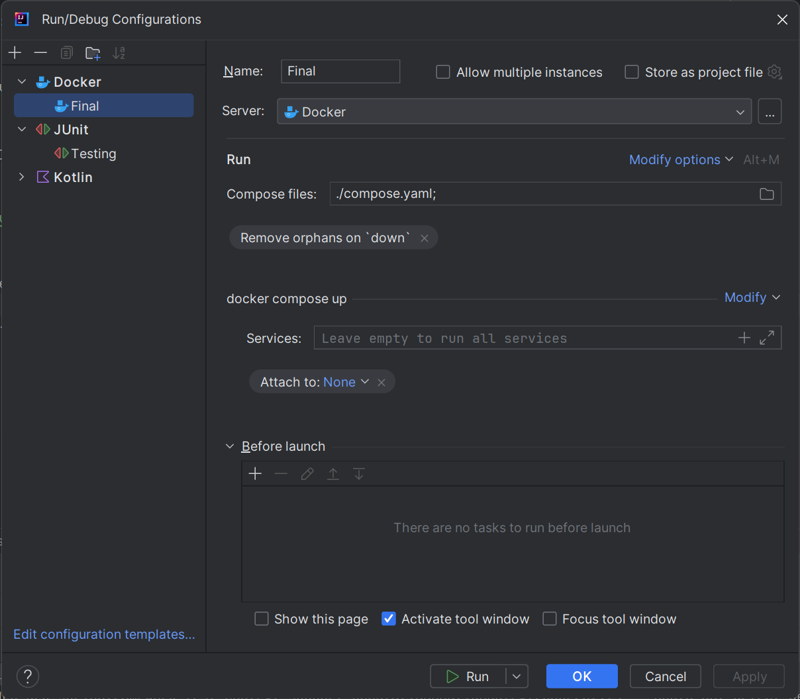
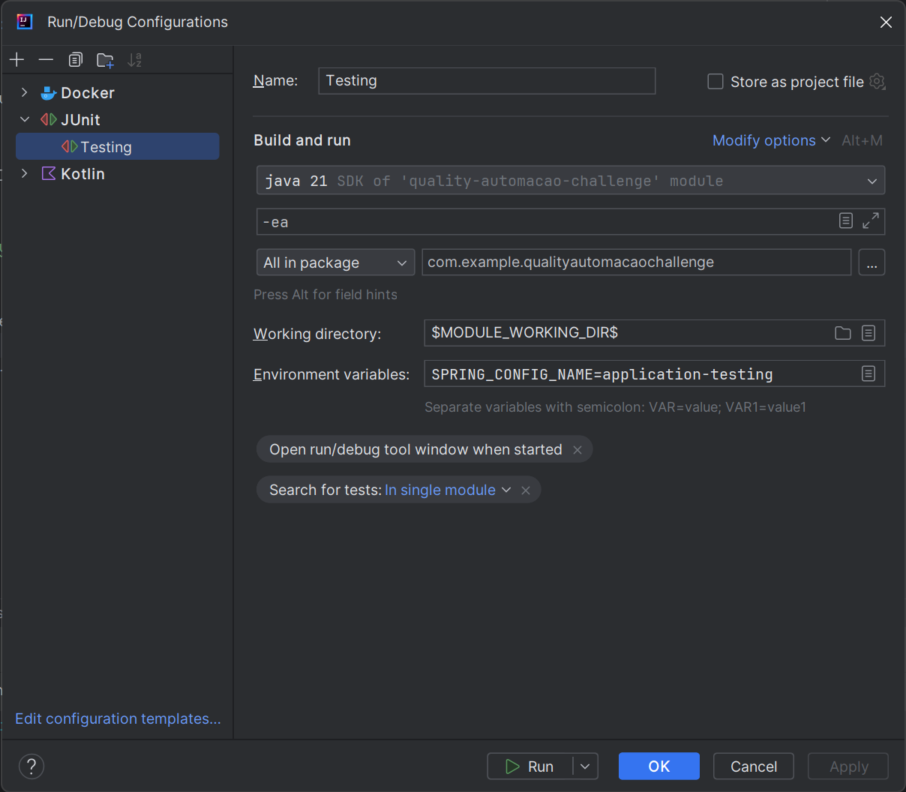
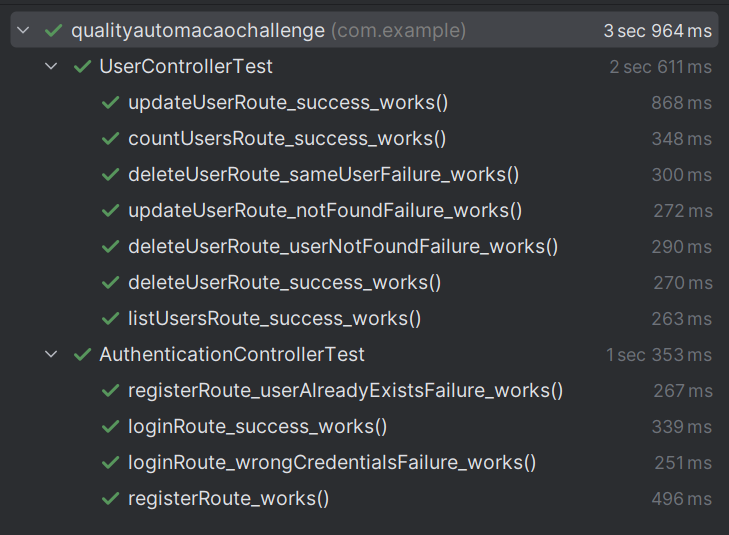

# Project Title

This project consists of a Rest API developed with Spring Boot and Kotlin, which allows you to manage users in a PostgreSQL database. The API implements the basic operations of creating, reading, updating and deleting (CRUD) users, following the principles of the Rest pattern. The API also has features such as authentication with Spring Security, unit testing and a route that shows statistics of registered users per day.

## Requisites

* Latest stable version of Docker and Docker Compose
* Postman
* If you prefer to run the project inside an IDE, the `Lombok` and `Docker` plugins may be necessary when applicable

## Installation

To install this project, follow the following steps:

1. Clone this repository to your local machine using the command:
```sh
git clone https://github.com/seu-usuario/api-rest-usuarios.git
```

2. Open the project in the terminal and run with:
```sh
docker compose up
```

In the end, both the Spring Boot API and the PostgreSQL database will start automatically, but if you still prefer to run everything outside the terminal and with an IDE (IntelliJ recommended), you just need to configure the support for Docker Compose and run the project (**important: don't forget to install the required plugins when applicable**):



3. Open Postman and import `quality-automação-challenge.postman_collection.json` API collection and the `development-environment.postman_environment.json` environment configuration that is in the project's postman folder. This files contains API routes, sample requests and the required environment variables to test the project.

## API Reference

Every API call is also documented in the Postman docs tab, in the controller source file.

#### Register a new user

```http
  POST /register
```

```json
{
  "username": "Quality",
  "password": "secret"
}
```

#### Login

This API call is configured in Postman to automatically set a variable with the returned token, so there is no need to manually set it to perform authenticated requests.

```http
  POST /login
```

```json
{
  "username": "Quality",
  "password": "secret"
}
```

#### List Registered Users

Requires authentication (Bearer Token)

```http
  GET /users
```

#### Delete User

Requires authentication (Bearer Token)

```http
  DELETE /user
```
| Parameter | Type     | Description                              |
| :-------- | :------- | :--------------------------------------- |
| `username`| `string` | **Required**. Username of user to delete |

#### Update User

Requires authentication (Bearer Token)

```http
  PUT /user
```
| Parameter | Type     | Description                              |
| :-------- | :------- | :--------------------------------------- |
|    `id`   | `string` | **Required**. ID of user to update       |

```json
{
  "username": "Quality_edited",
  "password": "secret_edited"
}
```

#### List Registered Users Count by Date

Requires authentication (Bearer Token)

```http
  GET /user-count
```

## Running Tests

The tests are already executed when starting the project with Docker Compose, but if you want to manually run them, follow this steps:

1. Open your favourite IDE and do the proper configurations (IntelliJ recommended):

  * Note that all tests in the package are configured to be run
  * Also note the environment variable `SPRING_CONFIG_NAME=application-testing`, don't forget to set it (**important**)



2. With all those configurations, you can just run the tests and wait for the results.


